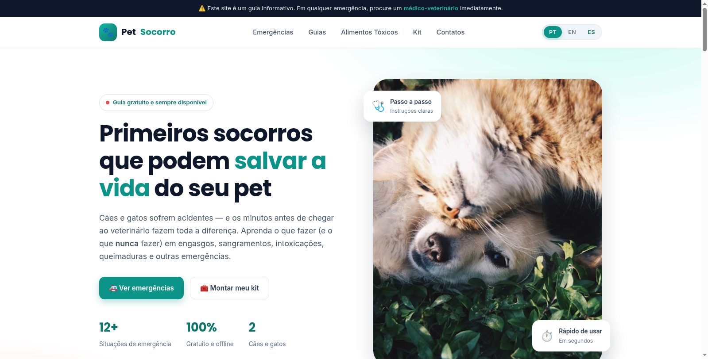
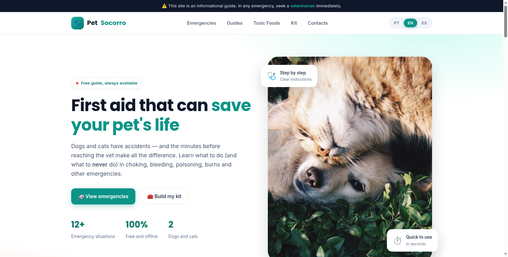
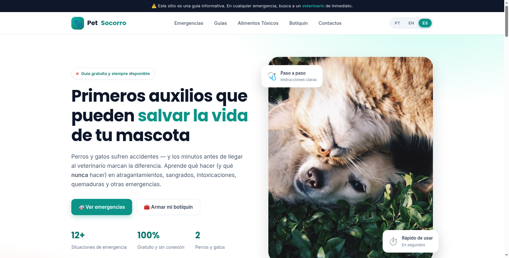

# 🐾 PetSocorro — Primeiros Socorros para Cães e Gatos

Um site **informativo, gratuito e responsivo** com guias práticos de primeiros socorros para cães e gatos. Em uma emergência, os minutos antes de chegar ao veterinário fazem toda a diferença — este projeto reúne orientações claras sobre o que fazer (e o que **nunca** fazer) em situações de risco.

> ⚠️ **Aviso:** este site tem caráter educativo e **não substitui** a avaliação de um médico-veterinário. Em qualquer emergência, procure imediatamente uma clínica veterinária.

---

## ✨ Funcionalidades

- **🌍 Multilíngue (PT / EN / ES):** todo o conteúdo disponível em **Português**, **English** e **Español**, com troca instantânea pelo seletor no cabeçalho — sem recarregar a página. A preferência de idioma é salva no navegador (`localStorage`).
- **12 situações de emergência** em cards interativos (engasgo, sangramento, intoxicação, RCP, queimaduras, insolação, fraturas, convulsão, picadas, afogamento, choque elétrico e lesão nos olhos).
- **Busca instantânea** que filtra as emergências em tempo real (com suporte a acentos, funcionando em qualquer idioma).
- **Guias passo a passo** em formato de acordeão, com instruções numeradas e avisos de segurança.
- **Lista de alimentos e produtos tóxicos** para cães e gatos.
- **Checklist do kit de primeiros socorros**.
- **Contatos de emergência** essenciais.
- **Design totalmente responsivo** (desktop, tablet e celular).
- **Animações de entrada** suaves com `IntersectionObserver`.
- **Acessibilidade**: navegação por teclado, `aria-label`s e respeito a `prefers-reduced-motion`.

## 🌍 Idiomas suportados

| Idioma | Código | Conteúdo |
|--------|--------|----------|
| Português | `pt` | Completo |
| English | `en` | Completo |
| Español | `es` | Completo |

O idioma inicial é detectado automaticamente a partir do navegador do usuário (`navigator.language`) e pode ser alterado a qualquer momento pelos botões **PT / EN / ES** no cabeçalho.

## 🛠️ Tecnologias

- **HTML5** semântico
- **CSS3** puro (variáveis, Grid, Flexbox, animações)
- **JavaScript** vanilla (sem frameworks nem dependências)
- **Google Fonts** (Poppins + Inter)
- Imagens do **Unsplash**

Nenhuma etapa de build é necessária — é só abrir o `index.html`.

## 📂 Estrutura do projeto

```
petsocorro/
├── index.html              # Página principal (marcação + atributos data-i18n)
├── assets/
│   ├── css/
│   │   └── styles.css      # Estilos (design system + responsivo + seletor de idioma)
│   ├── js/
│   │   ├── translations.js # Dicionário de traduções (PT / EN / ES)
│   │   └── script.js       # Renderização, busca, acordeões, menu, idioma e animações
│   └── img/                # Imagens locais (opcional)
├── README.md
├── LICENSE
└── .gitignore
```

## 🌐 Como funciona a internacionalização

1. **`translations.js`** expõe um objeto global `window.I18N` com três chaves (`pt`, `en`, `es`), cada uma contendo todo o conteúdo textual do site (títulos, cards, guias, tóxicos, kit, contatos etc.).
2. Os textos estáticos do HTML usam atributos `data-i18n`, `data-i18n-html`, `data-i18n-placeholder` e `data-i18n-content`.
3. As seções dinâmicas (cards, guias, listas) são renderizadas por funções em `script.js` a partir do idioma ativo.
4. Ao clicar em um botão de idioma, `setLanguage(lang)` atualiza o `lang` do `<html>`, o título da página, todos os textos estáticos e re-renderiza as seções dinâmicas — tudo em tempo real.

## 🚀 Como usar

### Opção 1 — Abrir direto
Basta abrir o arquivo `index.html` no navegador.

### Opção 2 — Servidor local (recomendado)
```bash
# Python 3
python3 -m http.server 8080

# ou Node.js
npx serve .
```
Depois acesse `http://localhost:8080`.

## 🖥️ Prévia



### 🌍 O mesmo site em três idiomas

| Português | English | Español |
|-----------|---------|---------|
|  |  |  |

| Seção | Descrição |
|-------|-----------|
| **Hero** | Apresentação com chamada para ação e estatísticas |
| **Emergências** | Grid de 12 cards com busca em tempo real |
| **Guias** | Acordeões com passo a passo detalhado |
| **Tóxicos** | Lista de alimentos/produtos perigosos |
| **Kit** | Checklist de itens de primeiros socorros |
| **Contatos** | Números de emergência e aviso legal |

## 🤝 Contribuindo

Contribuições são muito bem-vindas! Se você é veterinário(a) ou quer melhorar o conteúdo/código:

1. Faça um **fork** do projeto
2. Crie uma branch: `git checkout -b minha-melhoria`
3. Faça o commit: `git commit -m "Adiciona melhoria X"`
4. Envie a branch: `git push origin minha-melhoria`
5. Abra um **Pull Request**

> 💡 Sugestões de conteúdo devem ser baseadas em fontes veterinárias confiáveis.
> 🌍 Novas traduções também são bem-vindas — basta adicionar uma nova chave em `translations.js`.

## 📄 Licença

Este projeto está sob a licença **MIT**. Veja o arquivo [LICENSE](LICENSE) para mais detalhes.

## 👤 Autor

Feito com 💚 para quem ama animais.

---

<p align="center">
  <strong>🐶 PetSocorro 🐱</strong><br>
  Informação que pode salvar uma vida.
</p>
